IFT2255-A24-SessionProject

DESCRIPTION DU PROJET :

MaVille est une application en ligne de commande développée en Java, conçue pour améliorer la communication entre les secteurs public, privé, et la population de la ville de Montréal. Ce programme facilite la planification des travaux prévus, réduisant ainsi l'impact sur la circulation des résidents. L'application permet entre autres aux résidents de consulter les travaux en cours ou à venir, ce qui leur permet de planifier leurs déplacements, en plus de leur donner l'opportunité de faire des requêtes de travail. Du côté des intervenants, l'application MaVille leur permet de consulter les requêtes faites par les résidents, et de soumettre des projets. D'autres fonctionnalités comme des notifications personnalisées et les préférences d'horaire font de MaVille une application qui minimise les impacts des travaux sur le quotidien des citoyens tout en renforçant l'engagement des résidents et des intervenants.

--------------------------------------------

FONCTIONNALITÉS DE L'APPLICATION PAR RÔLE

Lorsqu'un résident est connecté dans l'applicaition MaVille, il peut:
- Créer un compte
  - Vérification regex
  - Vérification que le compte en cours de création n'utilise pas une adresse courriel déjà associée à un utilisateur existant.
- Se connecter/déconnecter
- Voir ses notifications non lues
- Consulter les travaux en cours
- Consulter les travaux à venir (3 prochains mois)
- Chercher et filtrer les travaux par quartier
- Consulter les entraves engendrées par un travail
- Chercher et filtrer les entraves par rue
- Soumettre une requête de travail
- Faire le suivi d'une requête de travail
  - Archiver requête de travail
  - Désarchiver requête de travail
  - Effacer requête de travail
  - Consulter les candidatures
    - Accepter la candidature
    - Refuser la candidature
- Consulter son profil
  - Voir toutes les données utilisateur
  - Voir ses préférences horaires
    - Ajouter et modifier une préférence horaire
    - Supprimer une préférence horaire
    
Lorsqu'un intervenant est connecté dans l'applicaition MaVille, il peut:
- Créer un compte
  - Vérification regex 
  - Vérification que le compte en cours de création n'utilise pas une adresse courriel ou un même cityId déjà associée à un utilisateur existant.
- Se connecter/déconnecter
- Consulter les requêtes de travail
  - Soumettre sa candidature 
- Faire le suivi de sa candidature
  - Soustraire sa candidature 
- Soumettre un projet
  - Envoi une notification aux résidents du quartier. 
- Modifier le statut d'un projet
  - Envoi une notification aux résidents du quartier.
- Consulter son profil
  - Voir toutes les données utilisateur
--------------------------------------------

ORGANISATION DU RÉPERTOIRE :
- Rapport de l'équipe : Comprend toutes les précisions, l'analyse des exigences, et les cas d'utilisation de l'application
- Prototype en ligne de commande : Un prototype simple permettant de simuler les actions des résidents et des intervenants.
- Diagrammes d'activités: Un fichier avec tous les diagrammes d'activité est présent dans le répertoire /images/diagrammes

--------------------------------------------

POUR EXÉCUTER L'APPLICATION:

Pour exécuter le programme de commande, vous devez utiliser la commande: "java -jar maville-prototype.jar" 
dans le répertoire du projet.

--------------------------------------------

POUR TESTER L'APPLICATION:

Pour tester l'application, voici les informations de connection
pour 5 résidents et pour 5 intervenants que vous pouvez entrer lors de la connection:
 
Résidents:  

- Résident 1  
email: emile.tremblay@example.com   
mot de passe : A1b2C3d4E5!F  

- Résident 2  
email: chloe.dube@mail.com  
mot de passe : ZxCvBn1234!!  

- Résident 3  
email: lucas.pelletier@webmail.ca  
mot de passe : QwErTyUiOp12  

- Résident 4  
  email: amelie.roy@moncourriel.com  
  mot de passe : AsDfGh123!@#  

- Résident 5  
  email: olivier.cloutier@example.com  
  mot de passe : P@ssW0rd!123  

Exemple de donnée "Résident" dans la base de donnée :  
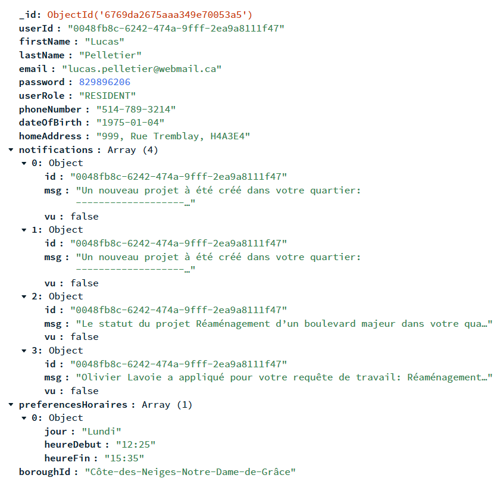

Intervenants:  

- Intervenant 1  
email: gabriel.tremblay@example.com  
mot de passe : A!b2C3d4E5Fg  
type d'entité : Entreprise publique

- Intervenant 2  
email: amelie.gagnon@mail.com  
mot de passe : ZxCvB1n2!#$  
type d'entité : Entrepreneur privé  

- Intervenant 3  
email: olivier@webmail.ca  
mot de passe : PqR1sT2u!@3  
type d'entité : Particulier  

- Intervenant 4  
  email: sophie.cloutier@moncourriel.com  
  mot de passe : AbCdE123!@#  
  type d'entité : Entreprise publique  

- Intervenant 5  
  email: lucas.bouchard@example.com  
  mot de passe : YxZ1WvT2Q3!  
  type d'entité : Entrepreneur privé

Exemple de donnée "Intervenant" dans la base de donnée :  
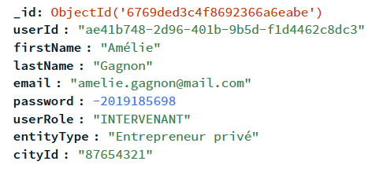

--------------------------------------------
Projets:

Projet 1:  
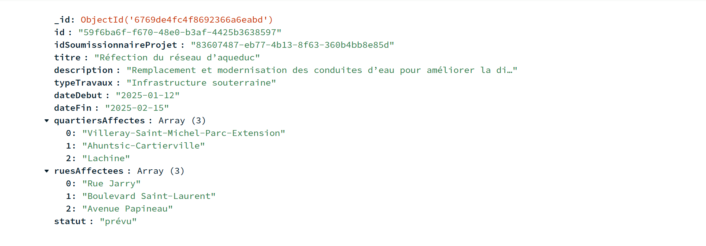

Projet 2:  
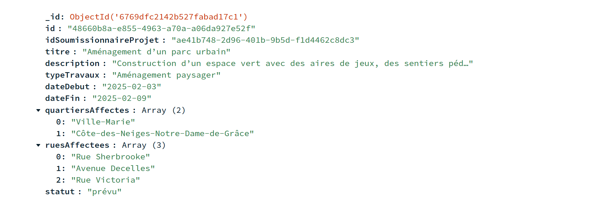

Projet 3:  
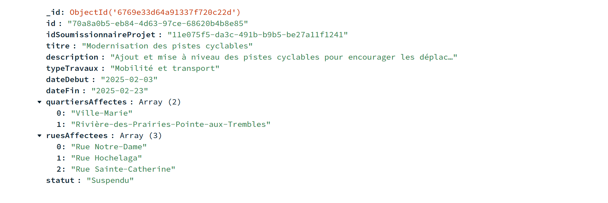

Projet 4:  
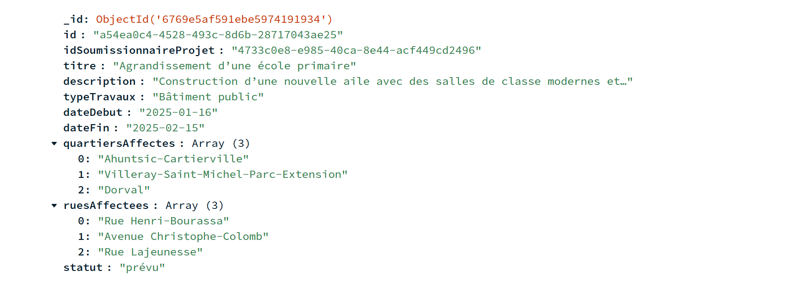

Projet 5:  
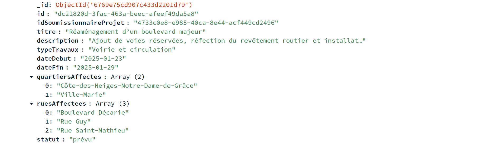

Projet 6:  

--------------------------------------------
Requêtes de travail: 

Requete de travail 1:  
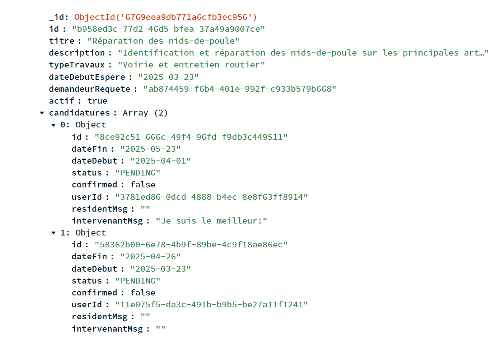

Requete de travail 2:  
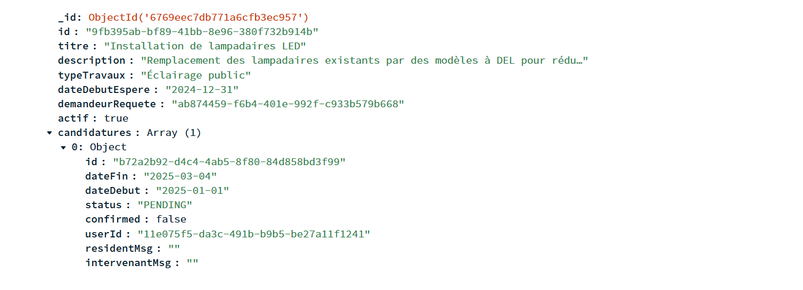

Requete de travail 3:  
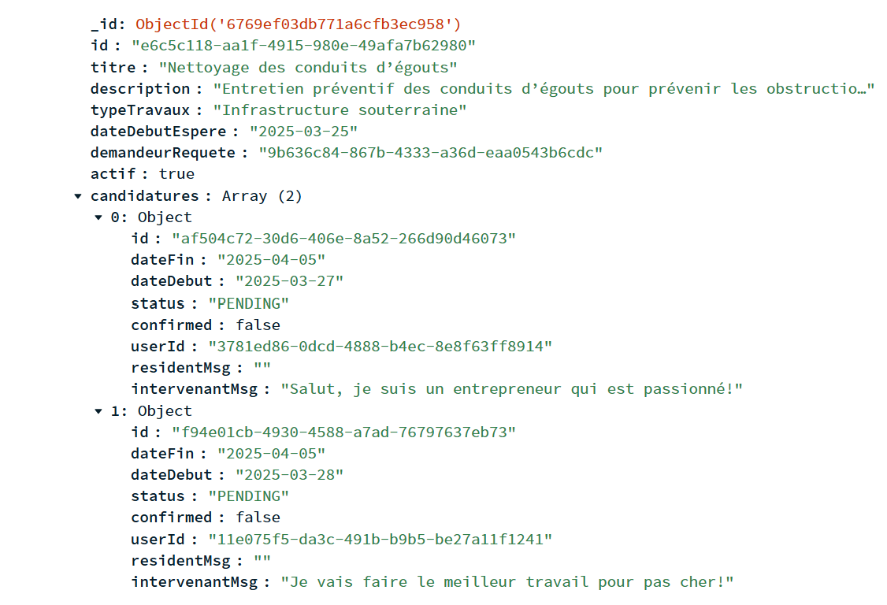

Requete de travail 4:  
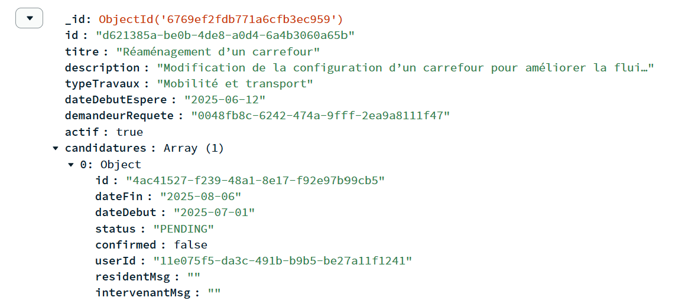

Requete de travail 5:  
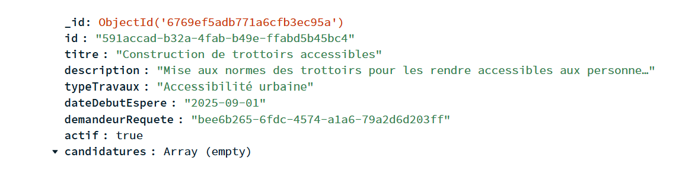

Requete de travail 6:  
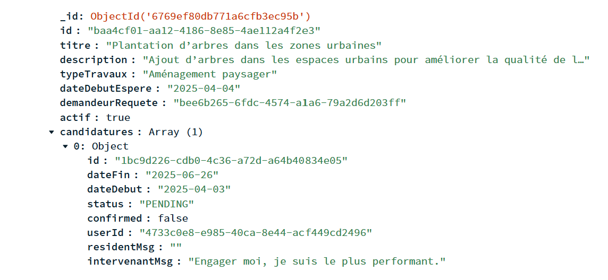

Requete de travail 7:  
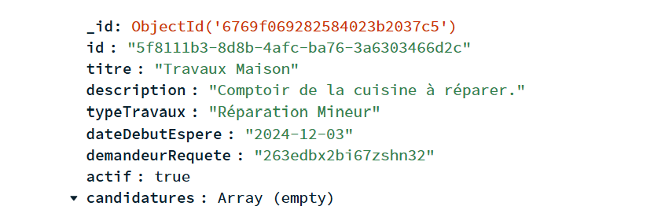

POUR RUN LES TESTS UNITAIRES:
Vous aurez besoin d'une version Maven assez récente (3.9+). Dans le répertoire du code, allez à Prototype\prototype et entrez "mvn test".
