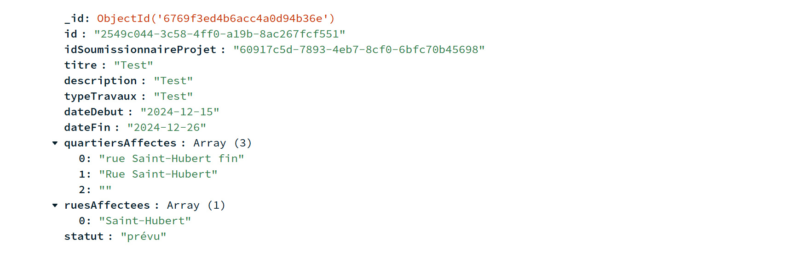

# **IFT2255-A24-SessionProject**

---

## **DESCRIPTION DU PROJET :**

MaVille est une application en ligne de commande développée en Java, conçue pour améliorer la communication entre les secteurs public, privé, et la population de la ville de Montréal. Ce programme facilite la planification des travaux prévus, réduisant ainsi l'impact sur la circulation des résidents. L'application permet entre autres aux résidents de consulter les travaux en cours ou à venir, ce qui leur permet de planifier leurs déplacements, en plus de leur donner l'opportunité de faire des requêtes de travail. Du côté des intervenants, l'application MaVille leur permet de consulter les requêtes faites par les résidents, et de soumettre des projets. D'autres fonctionnalités comme des notifications personnalisées et les préférences d'horaire font de MaVille une application qui minimise les impacts des travaux sur le quotidien des citoyens tout en renforçant l'engagement des résidents et des intervenants.

## **FONCTIONNALITÉS DE L'APPLICATION**

### **Pour les résidents :**
- **Compte utilisateur :**
  - Création et gestion de compte (vérification par regex, courriel unique).
  - Connexion et déconnexion.
- **Consultation et suivi :**
  - Voir les travaux en cours et à venir (3 prochains mois).
  - Filtrer les travaux par quartier ou rue.
  - Consulter les entraves associées aux travaux.
- **Requêtes de travail :**
  - Soumettre, suivre, archiver, désarchiver ou supprimer une requête.
  - Gérer les candidatures des intervenants (accepter ou refuser).
- **Gestion du profil :**
  - Modifier les préférences d’horaire.
  - Consulter les informations du compte.

### **Pour les intervenants :**
- **Compte utilisateur :**
  - Création de compte avec validation (courriel et identifiant uniques).
  - Connexion et déconnexion.
- **Projets :**
  - Soumettre des projets (notification aux résidents des quartiers concernés).
  - Modifier le statut d’un projet.
- **Requêtes de travail :**
  - Consulter les requêtes et soumettre des candidatures.
  - Suivre ou retirer une candidature.
- **Gestion du profil :**
  - Consulter les données du compte.

---

## **ORGANISATION DU RÉPERTOIRE :**
- **Rapport de l'équipe** : Analyse des exigences et cas d’utilisation.
- **Prototype en ligne de commande** : Simulation des interactions entre les résidents et intervenants.
- **Diagrammes d’activités** : Fichier dans `/images/diagrammes`.

---

## **INSTALLATION**

### **Prérequis :**
- Système d’exploitation : Windows, macOS ou Linux.
- Accès à un terminal/console.
- Fichier `maville-prototype.jar`.

### **Étape 1 : Installer Java**
1. Téléchargez la dernière version de Java :
  - [Oracle Java](https://www.oracle.com/java/technologies/javase-downloads.html)
  - [OpenJDK](https://openjdk.org/)
2. Suivez les instructions d’installation.
3. Vérifiez l’installation :
   ```bash
   java -version
   ```

### **Étape 2 : Installer Maven**

1. Téléchargez Maven : [https://maven.apache.org/download.cgi](https://maven.apache.org/download.cgi)
2. Configurez le chemin du dossier `bin` dans les variables d’environnement.
3. Vérifiez l’installation :
   ```bash
   mvn -v
   ```

### **Étape 3 : Ajouter un fichier `.env` pour la base de données**

L'application utilise une base de données MongoDB. Pour des raisons de sécurité, les informations de connexion ne sont **pas codées en dur** dans le projet. Elles doivent être définies dans un fichier `.env`.

#### **1. Créer un fichier `.env` à la racine du projet**

Ajoutez un fichier nommé `.env` dans le dossier racine du projet (au même niveau que `pom.xml` ou `maville-prototype.jar`), contenant les lignes suivantes :

```env
MONGODB_URI=mongodb+srv://<UTILISATEUR>:<MOT_DE_PASSE>@<CLUSTER>.mongodb.net/?retryWrites=true&w=majority&appName=MaVilleCluster
MONGODB_DB=MaVilleDataBase
```

**⚠️ Remplacez** `<UTILISATEUR>`, `<MOT_DE_PASSE>` et `<CLUSTER>` par vos propres identifiants MongoDB.

#### **2. Ne jamais versionner ce fichier**

Assurez-vous que le fichier `.env` est **exclu** du dépôt Git. Le fichier `.gitignore` doit contenir :

```
.env
```

#### **3. Vérifiez que la librairie `dotenv-java` est installée**

Le projet utilise la librairie [`dotenv-java`](https://github.com/cdimascio/dotenv-java) pour lire automatiquement les variables définies dans le `.env`. Cette dépendance est déjà ajoutée dans le `pom.xml`. Sinon, ajoutez :

```xml
<dependency>
    <groupId>io.github.cdimascio</groupId>
    <artifactId>dotenv-java</artifactId>
    <version>3.0.0</version>
</dependency>
```

---

## **Exécution des tests unitaires**

Pour exécuter les tests unitaires, suivez ces étapes :

1. Assurez-vous d'avoir installé Maven (v3.9+). Si ce n'est pas le cas, consultez la documentation d'installation de Maven.
2. Naviguez vers le répertoire du projet dans un terminal :
   ```bash
   cd Prototype/prototype
   ```
3. Entrez la commande :
   ```bash
   mvn test
   ```

---

## **POUR TESTER L'APPLICATION**

### **Comptes disponibles :**

### **Résidents:**

- **Résident 1**  
  email: emile.tremblay@example.com  
  mot de passe : A1b2C3d4E5!F

- **Résident 2**  
  email: chloe.dube@mail.com  
  mot de passe : ZxCvBn1234!!

- **Résident 3**  
  email: lucas.pelletier@webmail.ca  
  mot de passe : QwErTyUiOp12

- **Résident 4**  
  email: amelie.roy@moncourriel.com  
  mot de passe : AsDfGh123!@#

- **Résident 5**  
  email: olivier.cloutier@example.com  
  mot de passe : P@ssW0rd!123

**Exemple de donnée "Résident" dans la base de données :**  


---

### **Intervenants:**

- **Intervenant 1**  
  email: gabriel.tremblay@example.com  
  mot de passe : A!b2C3d4E5Fg  
  type d'entité : Entreprise publique

- **Intervenant 2**  
  email: amelie.gagnon@mail.com  
  mot de passe : ZxCvB1n2!#$  
  type d'entité : Entrepreneur privé

- **Intervenant 3**  
  email: olivier@webmail.ca  
  mot de passe : PqR1sT2u!@3  
  type d'entité : Particulier

- **Intervenant 4**  
  email: sophie.cloutier@moncourriel.com  
  mot de passe : AbCdE123!@#  
  type d'entité : Entreprise publique

- **Intervenant 5**  
  email: lucas.bouchard@example.com  
  mot de passe : YxZ1WvT2Q3!  
  type d'entité : Entrepreneur privé

**Exemple de donnée "Intervenant" dans la base de données :**  


---

## **POUR EXÉCUTER L'APPLICATION**
--------------------------------------------
1. Entrer la commande dans le répertoire du projet :
   ```bash
   java -jar maville-prototype.jar
   ```

---

## **Données storées dans Mongo DB**

--------------------------------------------
### **Projets:**

Projet 1:  


Projet 2:  


Projet 3:  


Projet 4:  


Projet 5:  


Projet 6:  


--------------------------------------------
### **Requêtes de travail:**

Requete de travail 1:  


Requete de travail 2:  


Requete de travail 3:  


Requete de travail 4:  


Requete de travail 5:  


Requete de travail 6:  


Requete de travail 7:  

